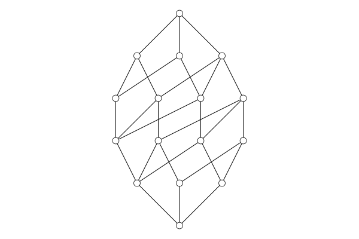

# DrawSimplePosets
Create and draw Hasse diagrams. This is a companion to `DrawSimpleGraphs`.

> **NOTE**: This is a work in progress; it is minimally functional.

## Overview

### Creating a Hasse diagram

A Hasse diagram is a drawing of a partially ordered set. Given a poset `P`,
we construct a drawing of `P` like this:
```
H = HasseDiagram(P)
```
At this point, `H` does *not* have an embedding of the elements of `P`. 

The function `setxy!(H, xy)` is used to assign coordinates to the elements of the poset. 
Here `xy` is a dictionary mapping elements of `P` (the poset used to create `H`) to 
points in the plane represented as a two-element vector. That is, if `P` is a `SimplePoset` whose elements have type `T`, then `xy` is of type `Dict{T, Vector{Float64}}`.

If `setxy!` is invoked as `setxy!(H)` then a default embedding is assigned to `H` (using the `basic_embedding` function).

Finally, calling `draw(H)` will draw the poset `P` on the screen using the embedding associated with `H`. 

For convenience, if `H` does not have an embedding, one will be automatically assigned to it using the `basic_embedding` function. 

Finally, if `draw` is applied to a poset `P`, then `draw(P)` is equivalent to `draw(HasseDiagram(P))`.

```
julia> using SimplePosets, DrawSimplePosets

julia> P = Divisors(120)
SimplePoset{Int64} (16 elements)

julia> draw(P)
```
results in this image:




## Basic Functions


### Creating a basic Hasse diagram

To create a Hasse diagram for a poset `P` use `HasseDiagram(P)`. This 
creates a `HasseDiagram` object with a rather basic embedding for the 
elements of `P`. For small posets, it's not too terrible.

To then view the poset, use `draw(H)`. 

The `draw` function may be used with a poset `P`. 
`draw(P)` is equivalent to `draw(HasseDiagram(P))`.

### Getting coordinates

Use `getxy(H)` to return a dictionary mapping the elements of the poset `P` 
to coordinates (values of type `Vector{Float64}`).

### Specifying an embedding

Given a dictionary mapping elements of a poset `P` to coordinates, use
`embed(P,xy)` to create a Hasse diagram in which element `v` has coordinates
`xy[v]`.


## Versus `DrawSimpleGraphs`

Drawings of undirected graphs using `SimpleGraphs` and `DrawSimpleGraphs` are attached to the graphs themselves. That is, the `xy`-embedding of an `UndirectedGraph` is part of the data structure 
of that graph. 

For partially ordered sets we take a different approach. A `SimplePoset` object contains no `xy`-embedding information. Rather, a `HasseDiagram` created from that poset has the embedding. It is possible to create two (or more) Hasse diagrams of the same poset, each with its own embedding. 